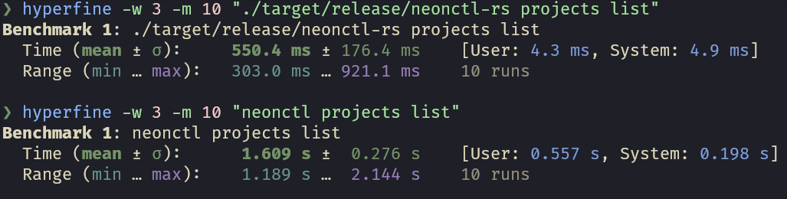

# Why?

neonctl is slow. Later I realised that their api also very slow, but the sunk cost fallacy will keep me going.

## haiatus

I need to use neon for a project, and the free tier only allows one project. So
this has to go on a haiatus, as I wont be able to test it without affecting my
project. I might still add features to this, as I plan on using neonctl-rs instead
of the js version of neonctl, or I might decide that it is worth it to upgrade
to a higher tier just to continue working on an side-project.

## TODO

- [ ] EXTRA: Region ms

- [ ] neon paid account so I can actually test this :(

- [ ] UNIT TESTS (IMPORTANT!!!)

- [ ] Aliases

- [x] neonctl auth: Authenticate, aliases: login

- [x] neonctl me: Show current user

- [ ] neonctl orgs: Manage organizations, aliases: org

**CURRENT SECONDARY FOCUS**
- [ ] neonctl projects: Manage projects, aliases: project
- [x] -- list
- [x] -- create
- [x] ------ OPTS: --name
- [x] ------ OPTS: --region-id
- [ ] ------ OPTS: --database
- [ ] ------ OPTS: --role
- [ ] ------ OPTS: --cu
- [ ] ------ OPTS: --psql
- [x] -- delete
- [x] -- -- EXTRA: delete by specifying name
- [x] -- get id
- [x] -- get with name
- [ ] -- update id
- [ ] -- shared with me

- [ ] neonctl ip-allow: Manage IP Allow

**CURRENT FOCUS**
- [ ] neonctl **branches**: Manage branches, aliases: branch
- [x] -- list: List branches
- [ ] -- create: Create a branch
- [ ] -- reset <id|name>: Reset a branch
- [ ] -- restore <target-id|name> <source>[@(timestamp|lsn)]: Restores a branch to a specific point in time <source> can be: ^self, ^parent, or <source-branch-id|name>
- [ ] -- rename <id|name> <new-name>: Rename a branch
- [ ] -- set-default <id|name>: Set a branch as default
- [ ] -- add-compute <id|name>: Add a compute to a branch
- [ ] -- delete <id|name>: Delete a branch
- [ ] -- get <id|name>: Get a branch
- [ ] -- schema-diff [base-branch] [compare-source[@(timestamp|lsn)]]: Compare the latest schemas of any two branches, or compare a branch to its own or another branch's history. [aliases: sd]

- [ ] neonctl databases: Manage databases, aliases: database, db

- [ ] neonctl roles: Manage roles, aliases: role

- [ ] neonctl operations: Manage operations, aliases: operation

- [ ] neonctl connection-string: Get connection string, aliases: cs

- [ ] neonctl set-context: Set the current context

- [ ] neonctl create-app: Initialize a new Neon project, aliases: bootstrap

- [ ] neonctl completion: generate completion script

- [ ] --output: Set output format: "json", "yaml", "table" (default)
- [ ] --config-dir: Config dir (/home/thepiguy/.config/neonctl)
- [ ] --api-key
- [ ] --color
